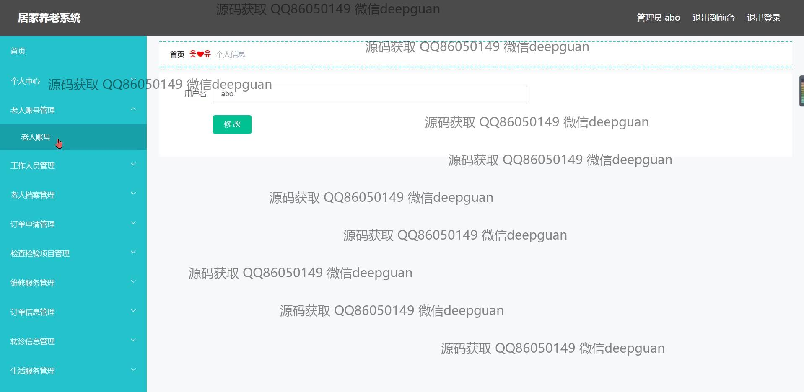
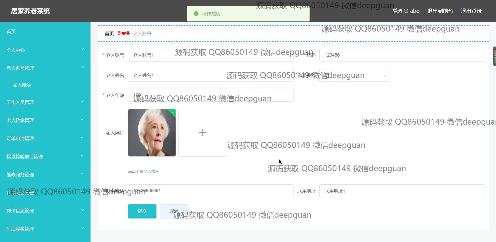
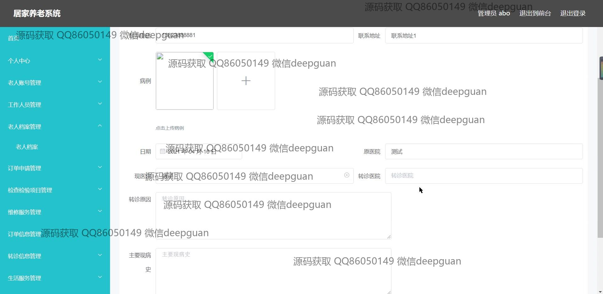
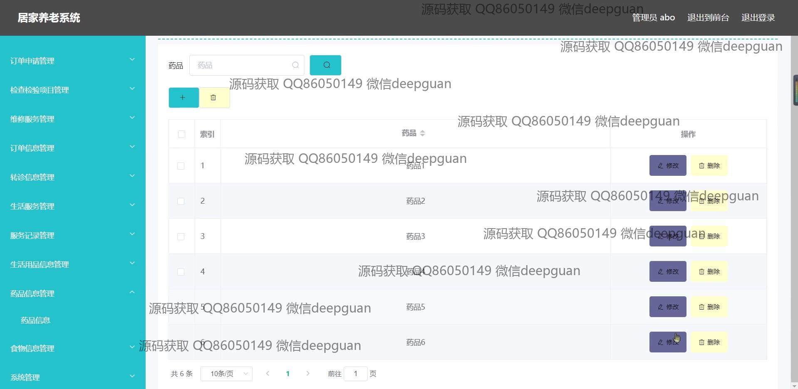
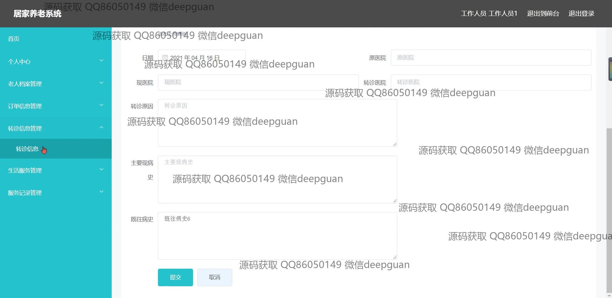

<h1 align="center">居家养老系统+vue</h1>

## 简介
居家养老系统：角色分为管理员、用户；主要功能包括老人档案管理、服务记录、订单管理、健康信息管理、生活服务等，通过简洁的界面提供便捷的养老服务管理。    --计算机毕业设计源码；毕设源码；java毕业设计源码

## 联系方式

<h3 align="center">获取完整代码与数据库文件 + 微信：deepguan QQ: 86050149 QQ群: 783742310</h3>

<h3 align="center">可帮忙远程部署 包运行成功！提供远程部署、修改代码、设计文档指导、代码讲解等服务！</h3>

## 功能介绍（完整见运行截图）
管理员：提供登录和退出功能，进行老人账号管理、工作人员管理、老人档案管理等，在左侧导航栏访问不同管理模块。管理订单申请、订单信息、转诊信息等，包括提交与修改服务信息，查看和操作用户数据，确保系统高效运作。支持搜索和筛选功能，上传和下载相关信息。顶部导航提供管理员信息展示。

工作人员：通过个人中心模块管理和更新自身信息，查看负责人相关工作信息。支持服务记录管理，生活服务详细展示，包括用户健康档案、服务预约、和紧急呼叫等操作。可以通过系统监控老人健康状况，及时处理老年服务需求，提高管理效率。

老人用户：通过简单的界面进行登录和注册，输入与查看个人健康档案、病历信息。使用订单管理功能进行服务申请，转介护理服务，查看订单状态，享受实时在线咨询服务。可更新个人资料和联系信息，通过系统与家属或医疗人员互动。

家属或关护人员：通过监控模块观察老年人健康信息，获取紧急联系人信息，加强对老人日常服务的关怀。支持信息安全确保个人数据的准确和及时更新，协助老年人进行服务预约和订单管理，提升居家养老安全性。

## 运行截图

本代码来源于网络,仅供学习参考使用!

